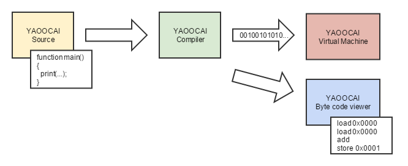

# YAOOCAI Programming language

## Table of contents
* [1. Introduction](#1-introduction)
* [2. Language](#2-language)
* [3. Compiler](#3-compiler)
* [4. Runtime](#4-runtime)

## 1. Introduction
_YAOOCAI_ is the short form for **Y**et **a**nother **o**bject **o**riented **c**ompiler **a**nd **i**nterpreter.
This is just a fun and educational project where a small compiler and a _Virtual Machine_ is build without going
too big. The aim is to write code and execute it platform independently.

### 1.1 Project status
**Language**:
 - \+ Functional part of the language is mostly working
 - \+ Functions/Functions calls are working fine. Distinction between normal procedures and functions with return
      values are done by language in a very clean way.
 - \- Object oriented part of the language is missing (no classes, no inheritance, ...)
 - \- No elseif currently supported (just if/else)
 - \- No while loops are supported
 - \- No for loops are supported
 - \- No break/continue is supported
 - \- Strings not fully supported. No specification about how to handle Strings
      (maybe to be put on hold until OO part has been finished)
 - \- No logical operators: &, |, !
 - \- No short circuit evaluation operators: &&, ||
 - \- Just integer, boolean, String as supported data types. No decimals are supported, no chars are supported
 - \- No cast operator supported between primitive data types
 - \- No concept to organize code (modules, name spaces, packages) -\> necessary for runtime!
 - \- Language documentation incomplete
 - \- No equality/inequality operator possible
 - \- No arrays are supported

**Scanner**:
 - \- No escape functionality
 - \- Support other chars on identifiers than a-z0-9

**Compiler/Translator**:
 - \+ Basic compilation working
 - \- No type security checks
 - \- No check on flow to return safely
 - \- Translator is producing stack pollution
 - \- No warn/error messages
 - \- no indication on main function missing
 - \- no check for duplicates (functions, variable names, ...)

**Byte code**
 - \+ Byte code instruction set fully specified
 - \- No metadata available (e.g. line number, function name, variable name, script name)
      -\> necessary to print stack traces
 - \- No constant pool for integers/strings
 - \- Extend operations to be aware of data type

**Virtual Machine**:
 - \+ Current Instruction set fully supported
 - \- No possibility to print stack trace

**Byte Code Viewer**:
 - \+ Current Instruction set can be interpreted and converted to human readable format
 - \- No function/variable names available (dependent on meta data in byte code)

**Runtime**:
 - \+ Built-In _Virtual Machine_ Functions are possible. exit/print is available.
 - \- Extended functionality (also written in _YAOOCAI_ is completely missing)

**Debugger**: completely missing.

**Optimizer**:
 - Compiler: Need for compiler optimization (e.g. short function inlining, short function parameters to not store
   variables in local variable stack, operator optimization, ...)
 - _Virtual Machine_: expressions to use java directly?

## 1.2. Big picture


The object oriented compiler is analyzing .yaoocai source file and checking for
proper syntax. The compiled code is translated into a binary form which
can then be interpreted by a _Virtual Machine_. It is also planned to provide a short
runtime with extended libraries containing at least collections, IO operations and
many other stuff.

## 2. Language
### 2.1. Language characteristics
#### 2.1.1. Comments
TODO
#### 2.1.2. Keywords
TODO add list of keywords (if, else, while, function, var, builtin, return, true, false, integer, boolean)

#### 2.1.3. Control structure
TODO currently supported if/else, while

#### 2.1.4. Data types and Variables
TODO add basic description of supported data types. how to introduce variables

#### 2.1.5. Literals
TODO how to write literals, string literals later. what character set is supported for strings, ...

#### 2.1.6. Identifier
TODO What is a valid identifier

#### 2.1.7. Operators
TODO Structure operators. What can be used for what? Operator priority order.

#### 2.1.8. Functions
TODO how to write functions, no need define in order

#### 2.1.9. Built-in Functions
TODO how to define built-in functions

#### 2.1.10 Runtime
TODO how to have access to the language runtime. explain vmfunc, maybe other sys calls possible? or get rid of vmfunc?

### 2.2. Grammar
#### 2.2.1. Convention
BNF like description of grammar with these conventions:
* Literals are declared within single quotes. E.g.: `'+'`
* Rule names (left side) are written in diamond brackets. E.g. `<Rule>`
* Rules (right side) contains references to other rules, terminal symbols or non terminal symbols
* Rule names and rules are glued together with assignment operator `::=`
* Possible occurrences: One or zero -> `[Rule]`, Zero or more -> `{Rule}`
* Choices are made with brackets and pipe symbol `(Rule1 | Rule 2)`

#### 2.2.2. Grammar description
Parser Rules
```
<Script>               ::= {BuiltInFunctionDeclaration} {FunctionDeclaration}

<BuiltInFunctionDeclaration>
                       ::= 'builtin' 'function' Identifier Parameters [Colon Type]
<BuiltInFunctionDeclarationAssignment>
                       ::= BuiltInFunctionDeclarationOperator Identifier ParStart {Digit} ParEnd
<FunctionDeclaration>  ::= 'function' Identifier Parameters [Colon Type] Block
<Parameters>           ::= ParStart [ParameterDeclarations] ParEnd
<ParameterDeclarations>::= ParameterDeclaration {Comma ParameterDeclaration}
<ParameterDeclaration> ::= Identifier Colon Type

<Block>                ::= BlockStart {BlockStatement} BlockEnd
<BlockStatement>       ::= (LocalVariableDeclarationStatement | Statement)
<LocalVariableDeclarationStatement>
                       ::= 'var' Identifier Colon Type [Equals Expression] SemiColon
<Statement>            ::= (
                               Block |
                               IfStatement |
                               WhileStatement |
                               ReturnStatement |
                               ExpressionStatement
                           )
<ExpressionStatement>  ::= Expression SemiColon

<IfStatement>          ::= 'if' ParExpression Block ['else' Block]
<WhileStatement>       ::= 'while' ParExpression Block
<ReturnStatement>       ::= 'return' Expression SemiColon

<Expression>           ::= AssignmentExpression
<AssignmentExpression> ::= ConditionalOrExpression [(
                                                        AssignmentOperator |
                                                        AdditionAssignmentOperator |
                                                        SubtractionAssignmentOperator |
                                                        MultiplicationAssignmentOperator |
                                                        DivisionAssignmentOperator
                                                    ) ConditionalOrExpression]
<ConditionalOrExpression>
                       ::= ConditionalAndExpression {ConditionalOrOperator ConditionalAndExpression}
<ConditionalAndExpression>
                       ::= BitwiseOrExpression {ConditionalAndOperator BitwiseOrExpression}
<BitwiseOrExpression>
                       ::= BitwiseAndExpression {BitwiseOrOperator BitwiseAndExpression}
<BitwiseAndExpression>
                       ::= ComparisonExpression {BitwiseAndOperator BitwiseAndExpression}
<ComparisonExpression> ::= AdditiveExpression {(
                                                   EqualsOperator |
                                                   NotEqualsOperator |
                                                   GreaterOperator |
                                                   GreaterOrEqualOperator |
                                                   LessOrEqualOperator |
                                                   LessOperator
                                               ) AdditiveExpression}
<AdditiveExpression>   ::= MultiplicativeExpression {(
                                                         AdditionOperator |
                                                         SubtractionOperator
                                                     ) MultiplicativeExpression}
<MultiplicativeExpression>
                       ::= PreIncrementExpression {(
                                        MultiplicationOperator |
                                        DivisionOperator |
                                        ModuloOperator
                                    ) PreIncrementExpression}
<PreIncrementExpression>
                     ::= [(
                              IncrementOperator |
                              DecrementOperator
                           )] PrefixExpression
<PrefixExpression>   ::= {(
                              NegationOperator |
                              AdditionOperator |
                              SubtractionOperator
                          )} Primary
<Primary>              ::= (
                               Literal |
                               ParExpression |
                               Variable [PostfixOperations] |
                               FunctionCall
                           )
<PostfixOperations>    ::= (
                               IncrementOperator |
                               DecrementOperator
                           )

<ParExpression>        ::= ParStart Expression ParEnd
<Variable>             ::= Identifier
<FunctionCall>         ::= Identifier ParStart [Arguments] ParEnd
<Arguments>            ::= Expression {Comma Expression}
<Literal>              ::= (
                               IntegerLiteral |
                               BooleanLiteral
                           )
<Type>                 ::= (
                               BasicType |
                               ReferenceType
                           )
<ReferenceType>        ::= Identifier // TODO supported for later OO or String
```
Scanner Rules:
```
<Identifier>           ::= Character {Character | Digit}

<BasicType>            ::= 'integer' | 'boolean'
<IntegerLiteral>       ::= {Digit}
<BooleanLiteral>       ::= ('true' | 'false')

<PlusOperator>         ::= '+'
<MinusOperator>        ::= '-'
<MultiplicationOperator>
                       ::= '*'
<DivisionOperator>     ::= '/'
<ModuloOperator>       ::= '%'
<EqualsOperator>       ::= '=' '='
<NotEqualsOperator>    ::= '!' '='

<GreaterOperator>      ::= '>
<GreaterOrEqualOperator>
                       ::= '>' '='
<LessOperator>         ::= '<'
<LessOrEqualOperator>  ::= '<' '='

<AssignmentOperator>   ::= '='
<AdditionAssignmentOperator>
                       ::= '+' '='
<SubtractionAssignmentOperator>
                       ::= '-' '='
<MultiplicationAssignmentOperator>
                       ::= '*' '='
<DivisionAssignmentOperator>
                       ::= '/' '='

<IncrementOperator>    ::= '+' '+'
<DecrementOperator>    ::= '-' '-'

<NegationOperator>     ::= '!'
<BitwiseOrOperator>    ::= '|'
<BitwiseAndOperator>   ::= '&'
<ConditionalOrOperator>::= '|' '|'
<ConditionalAndOperator>
                       ::= '&' '&'

<BuiltInFunctionDeclarationOperator>
                       ::= '-' '>'

<Colon>                ::= ':'
<SemiColon>            ::= ';'
<Comma>                ::= ','

<BlockStart>           ::= '{'
<BlockEnd>             ::= '}'
<ParStart>             ::= '('
<ParEnd>               ::= ')'

<Digit>                ::= '0' | '1' | '2' | '3' | '4' | '5' | '6' | '7' | '8' | '9'
<Character>            ::= 'A' | 'B' | 'C' | ... | 'Z' | 'a' | 'b' | 'c' | ... | 'z'
```

### 2.3. Examples
#### 2.3.1. Basic Hello World
TODO Add basic hello world example
#### 2.3.2. Other examples
TODO Add other examples

## 3. Compiler
TODO how to handle the compiler

## 3. Virtual machine
### 3.1 Introduction
The compiler reads the source code and translates it into the _YAOOCAI_ byte code. This sequence of binary
data can be executed with a _Virtual Machine_ which is a simple stack machine which follows a limited instruction
set (see following section). Each sequence is a Word (2 Bytes) long.

### 3.2 Instruction set
Mnemonic          | OpCode (hex)   | Params         | Stack change                        | Description
------------------|----------------|----------------|-------------------------------------|---
`function`        | `0x0000`       |                |                                     | Indicator for the _Virtual Machine_ to determine where a function starts within the sequence.
`i_const`         | `0x0100`       | `1: value`     | &rarr; `value`                      | Pushes constant `value` onto the stack
`b_const_true`    | `0x0101`       |                | &rarr; `true`                       | Pushes `true` onto the stack
`b_const_false`   | `0x0102`       |                | &rarr; `false`                      | Pushes `false` onto the stack
`store`           | `0x0200`       | `1: index`     | `value` &rarr;                      | Pops `value` and stores the value on local variable stack at position `index`
`load`            | `0x0201`       | `1: index`     | &rarr; `value`                      | Pushes `value` onto the stack from local variable stack from position `index`
`invoke`          | `0x0300`       | `1: funcIndex` | `[arg1, arg2, ...]` &rarr; `result` | Invokes function from function index `funcIndex`. Pops the arguments `arg1, arg2, ...` with help of `pop_params`. Pushes the `result` onto the stack with help of the `return` instruction.
`invoke_builtin`  | `0x0301`       | `1: funcIndex` | `[arg1, arg2, ...]` &rarr; `result` | Invokes a built-in function from the _Virtual Machine_ with the index `funcIndex`. The _Virtual Machine_ takes care to pop the arguments `arg1, arg2, ...` and use it for the function call. The `result` internally is pushed onto the stack.
`add`             | `0x0400`       |                | `v1`, `v2` &rarr; `result`          | Adds two integers `v1` and `v2` and pushes the `result` onto the stack.
`sub`             | `0x0401`       |                | `v1`, `v2` &rarr; `result`          | Subtract two integers `v1` and `v2` and pushes the `result` onto the stack.
`mul`             | `0x0402`       |                | `v1`, `v2` &rarr; `result`          | Multiply two integers `v1` and `v2` and pushes the `result` onto the stack.
`div`             | `0x0403`       |                | `v1`, `v2` &rarr; `result`          | Divides two integers `v1` and `v2` and pushes the `result` onto the stack.
`cmp_lt`          | `0x0500`       |                | `v1`, `v2` &rarr; `result`          | Pops two integers `v1` and `v2` and checks that that `v1` is less than `v2`. Pushes `true` or `false` onto the stack as `result`
`cmp_lte`         | `0x0501`       |                | `v1`, `v2` &rarr; `result`          | Pops two integers `v1` and `v2` and checks that that `v1` is less than or equal to `v2`. Pushes `true` or `false` onto the stack as `result`
`cmp_gt`          | `0x0502`       |                | `v1`, `v2` &rarr; `result`          | Pops two integers `v1` and `v2` and checks that that `v1` is greater than `v2`. Pushes `true` or `false` onto the stack as `result`
`cmp_gte`         | `0x0503`       |                | `v1`, `v2` &rarr; `result`          | Pops two integers `v1` and `v2` and checks that that `v1` is greater than or equal to `v2`. Pushes `true` or `false` onto the stack as `result`
`if`              | `0x0600`       | `1: elseJump`  | `condition` &rarr;                  | Pops the `condition` from stack. If `condition` does met the _Virtual Machine_ jumps one instruction further. If the `condition` does not met the _Virtual Machine_ jumps `elseJump` instructions further or back (relative).
`goto`            | `0x0601`       | `1: jump`      |                                     | Jumps `jump` instructions further or back (relative).
`return`          | `0x0602`       |                |                                     | Indicator for the _Virtual Machine_ that the execution of current function ends. Jumps back to last function or if not possible ends the execution of the code.
`pop_params`      | `0x0603`       | `1: params`    | `[arg1, arg2, ...]` &rarr;          | Pops `params` number of items (`arg1, arg2, ...`) from the stack and adds them to the local variable register.


### 3.3 Byte code grammar
*Byte code*

See [2.2.1. Convention](#221-convention) for convention styles.
```
<Script>              ::= 'yaoocai' ScriptHeader ScriptBody
<ScriptHeader>        ::= VersionData MainFunctionIndex
<VersionData>         ::= Word Word    // major/minor version
<MainFunctionIndex>   ::= Word
<ScriptBody>          ::= {Function}
<Function>            ::= FunctionOpCode {Instruction}
<Instruction>         ::= (
                              ConstantOperations |
                              StackOperations |
                              InvokeOperations |
                              ArithmeticalOperations |
                              CompareOperations |
                              ControlOperations
                          )

<ConstantOperations>  ::= (
                              IntegerConstant |
                              BooleanConstant
                          )
<IntegerConstant>     ::= IntegerConstOpCode value=Byte
<BooleanConstant>     ::= (
                              BooleanTrueOpCode |
                              BooleanFalseOpCode
                          )

<StackOperations>     ::= (
                              StoreOperation |
                              LoadOperation
                          )
<StoreOperation>      ::= <StoreOpCode> index=Word
<LoadOperation>       ::= <LoadOpCode> index=Word

<InvokeOperations>    ::= (
                              InvokeOperation |
                              InvokeBuiltinOperation
                          )
<InvokeOperation>     ::= InvokeOpCode funcIndex=Word
<InvokeBuiltinOperation>
                      ::= InvokeBuiltInOpCode funcIndex=Word

<ArithmeticalOperations>
                      ::= (
                              AddOperation |
                              SubOperation |
                              MulOperation |
                              DivOperation
                          )
<AddOperation>        ::= AddOpCode
<SubOperation>        ::= SubOpCode
<MulOperation>        ::= MulOpCode
<DivOperation>        ::= DivOpCode

<CompareOperations>   ::= (
                              LTComparison |
                              LTEComparison |
                              GTComparison |
                              GTEComparison
                          )
<LTComparison>        ::= LTOpCode
<LTEComparison>       ::= LTEOpCode
<GTComparison>        ::= GTOpCode
<GTEComparison>       ::= GTEOpCode

<ControlOperations>   ::= (
                              IfOperation |
                              GotoOperation |
                              ReturnOperation |
                              PopParamsOperation
                          )
<IfOperation>         ::= IfOpCode elseJump=Word
<GotoOperation>       ::= GotoOpCode jump=Word
<ReturnOperation>     ::= ReturnOpCode
<PopParamsOperation>  ::= PopParamsOpCode numParams=Word

```
*OpCode-Level*
```
<FunctionOpCode>      ::= 0x0000

<IntegerConstOpCode>  ::= 0x0100
<BooleanTrueOpCode>   ::= 0x0101
<BooleanFalseOpCode>  ::= 0x0102

<StoreOpCode>         ::= 0x0200
<LoadOpCode>          ::= 0x0201

<InvokeOpCode>        ::= 0x0300
<InvokeBuiltInOpCode> ::= 0x0301

<AddOpCode>           ::= 0x0400
<SubOpCode>           ::= 0x0401
<MulOpCode>           ::= 0x0402
<DivOpCode>           ::= 0x0403

<LTOpCode>            ::= 0x0500
<LTEOpCode>           ::= 0x0501
<GTOpCode>            ::= 0x0502
<GTEOpCode>           ::= 0x0503

<IfOpCode>            ::= 0x0600
<GotoOpCode>          ::= 0x0601
<ReturnOpCode>        ::= 0x0602
<PopParamsOpCode>     ::= 0x0603

<Word>                ::= Byte Byte
```

## 4. Runtime
TODO This is completely open

